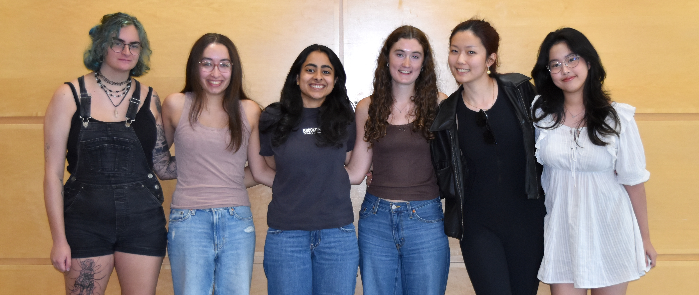

# 02-Team Repo
Template for team repo

This is my team

## Project Description
This project proposes the development of an interactive pickleball paddle training system. The system integrates multiple sensing technologies (e.g. IMU, UWB) on our custom-designed paddle for precise movement tracking, which is then used to simulate the user’s motions within a virtual environment. Additionally, the paddle will feature haptic feedback for an enhanced experience. On the virtual side, the paddle will interface with Unreal Engine to provide engaging virtual games of pickleball with realistic ball dynamics.

## Team links
- [Team Google Drive](https://drive.google.com/drive/folders/1Vt4XvksvtD6GoQXf9IWy8oRvdENAPYB3?usp=drive_link)

## Course links
- [ECE Senior Design Piazza Site](https://piazza.com/bu/fall2025/ec463/home)
- [Blackboard](http://learn.bu.edu/)

## Optional features links
- Team Jira
- Team Confluence
- Something else

